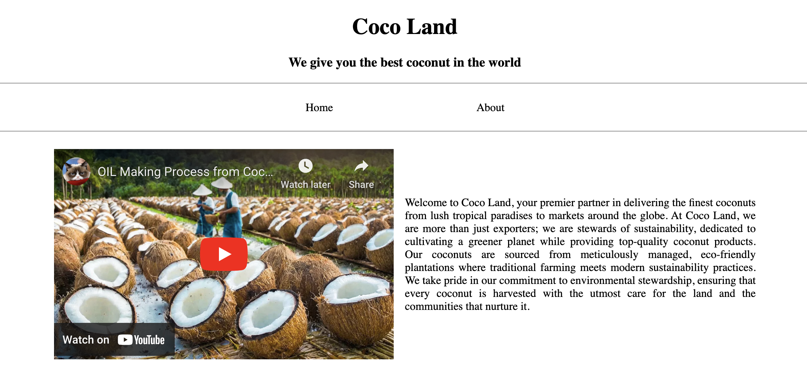
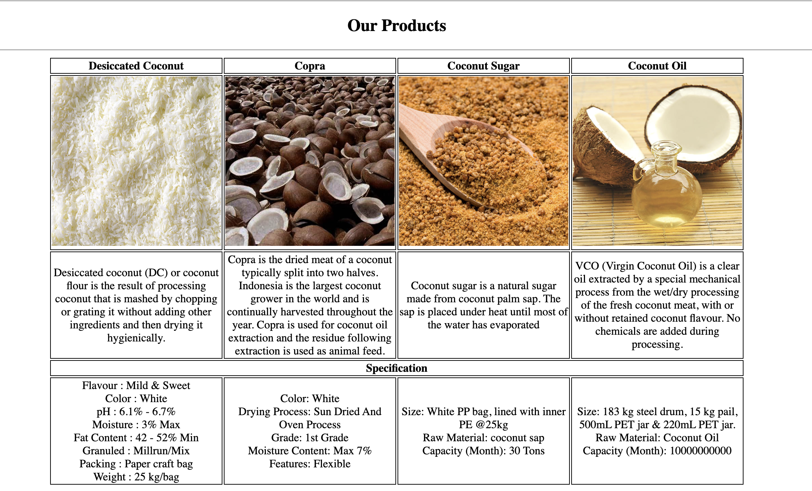
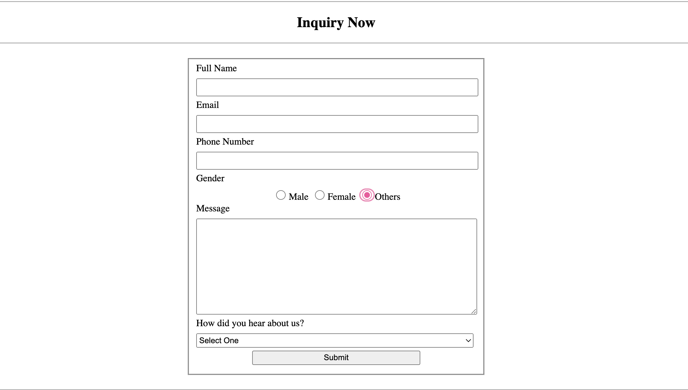

# Coco Land Project

This is the documentation for the Coco Land project.
The website will be built using HTML and simple CSS only without any framework.
The goal of this project is to learn how to build a simple website and understand more about HTML tags. In this project I try to use only HTML semantic tags.

## HTML Tags used in this project 
1. **HTML Boilerplate**

- The ```<!DOCTYPE html>``` declaration is essential for rendering HTML5 elements correctly in browsers.

- The ```html``` tag serves as the root of the HTML document, containing the head and body tags, and supports the `lang` attribute to specify the document's language, enhancing accessibility and SEO.

- The ```head``` tag contains metadata like meta tags, title tags, link tags, scripts, and stylesheets, which are crucial for SEO and user experience but not visible on the page.

- The ```meta``` tag provides additional metadata to help search engines and social platforms understand and display the website content.

- The ```title``` tag defines the browser title bar text, representing the webpage's title.

- The ```link``` tag is used to establish relationships with other documents, typically for linking stylesheets or pre-defined relationships.

- The ```body``` tag encompasses all visible webpage content, although it can also include non-visible elements like scripts and styles.

2. **HTML Tags for Content**

-  The ```<h1>``` tag is utilized for the primary heading of the webpage, typically the most important title. <br>
Sample use: ```<h1>Coco Land</h1>```

-  The ```<h2>``` tag is employed for secondary headings, which are subheadings under the main title. <br>
Sample use: ```<h2>Welcome to Coco Land</h2>```

-  The ```<p>``` tag is used to encapsulate paragraphs, providing structure to the textual content. <br>
Sample use: ```<p>Welcome to Coco Land</p>```

- The ```<hr>``` tag inserts a thematic break in the form of a horizontal line, often used for visual separation.

- The ```<a>``` tag defines hyperlinks that connect to other pages or resources, essential for navigation. <br>
Sample use: ```<a href="https://cocoland.com">Coco Land</a>```

- The ```<ul>``` tag is used to create an unordered list, where each list item is marked with a bullet. <br>
Sample use: ```<ul><li>Coco Land</li></ul>```

- The ```<li>``` tag is used to create list items, defining each item in an unordered or ordered list. <br>
Sample use: ```<ul><li>Coco Land</li></ul>```

- The `````` tag is used for embedding images into the page, enhancing visual engagement. <br>
Sample use: ``````

- The ```<iframe>``` tag is used to embed another HTML document within the current one, providing a way to display content from another source. <br>
Sample use: ```<iframe src="https://cocoland.com" width="500" height="300"></iframe>```

- The ```<nav>``` tag structures the navigation links, making the site easier to explore.

- The ```<header>``` tag marks the top section of the webpage, often containing introductory content and navigation links.

- The ```<main>``` tag signifies the primary content area of the webpage, distinct from sidebars or footers.

- The ```<footer>``` tag is used at the bottom of the webpage, typically containing copyright information, contact details, or additional links.

- The ```<section>``` tag defines distinct sections within a webpage, each typically themed or grouped together logically. <br>
Sample use: ```<section class="about">About Us</section>```

- The ```<form>``` tag creates a form on the webpage to collect user inputs. <br>
Sample use: ```<form action="/submit-form" method="post"></form>```

- The ```<input>``` tag is used within forms to allow users to enter data. It supports various types such as text, email, and password. <br>
Sample use: ```<input type="text" name="username">```

- The ```<label>``` tag provides a label for an input element, improving form accessibility and usability. <br>
Sample use: ```<label for="username">Username:</label>```

- The ```<textarea>``` tag creates a multi-line text input field, suitable for longer user inputs like comments. <br>
Sample use: ```<textarea name="comment" rows="4"></textarea>```

- The ```<select>``` tag is used to create a dropdown list, allowing users to select an option from multiple choices. <br>
Sample use: ```<select name="country"><option value="USA">United States</option></select>```

- The ```<option>``` tag defines the individual options within a select dropdown. <br>
Sample use: ```<option value="USA">United States</option>```

- The ```<fieldset>``` tag groups related form elements, providing a structured way to organize and group them. <br>
Sample use: ```<fieldset><legend>Personal Information</legend><input type="text" name="username"></fieldset>```

- The ```<table>``` tag is used to create a table in the webpage, displaying data in rows and columns. <br>
Sample use: ```<table><tr><td>Coco Land</td></tr></table>```

- The ```<tr>``` tag is used to create a table row, containing table data. <br>
Sample use: ```<table><tr><td>Coco Land</td></tr></table>```

- The ```<td>``` tag is used to create a table data cell, containing the actual data. <br>
Sample use: ```<table><tr><td>Coco Land</td></tr></table>```

- The ```<th>``` tag is used to create a table header cell, containing the header information. <br>
Sample use: ```<table><tr><th>Coco Land</th></tr></table>```

- The ```<thead>``` tag is used to group the header content of a table. <br>
Sample use: ```<table><thead><tr><th>Coco Land</th></tr></thead></table>```

- The ```<tbody>``` tag is used to group the body content of a table. <br>
Sample use: ```<table><tbody><tr><td>Coco Land</td></tr></tbody></table>```

## References
- [MDN Web Docs](https://developer.mozilla.org/en-US/docs/Web/HTML)
- [Ina Export](https://inaexport.id/) for Coco Land Content
- [Icons](https://icons8.com/icons/) 
- Images from Google Images
- Video from YouTube

## Attachment





## About Me


<p>I am Evania Joycelin. 
I love minion and pink color. </p>

<p>Please reach out to me:</p> 
    <a href="https://www.linkedin.com/in/evania-joycelin-437714153/">
        
    </a> 
    <a href="https://www.instagram.com/evaniajoycelin/">
        
    </a> 
<br><br>

> _We shall not flag or fail. We shall go on to the end. We shall fight in France, we shall fight on the seas and oceans, we shall fight with growing confidence and growing strength in the air. We shall defend our island, whatever the cost may be. We shall fight on the beaches, we shall fight on the landing-grounds, we shall fight in the fields and in the streets, we shall fight in the hills. We shall never surrender!” — Winston Churchill, House of Commons, 4 June 1940_