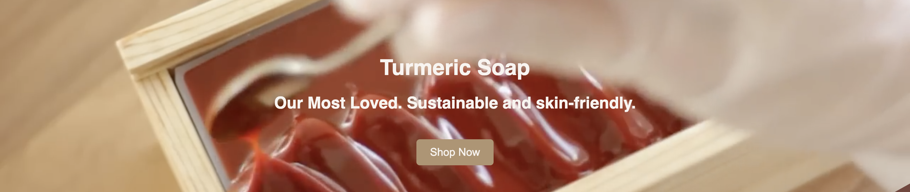
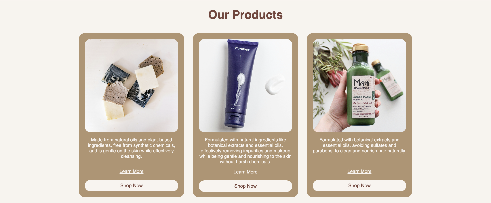
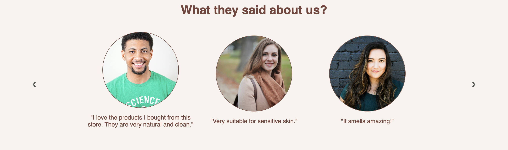
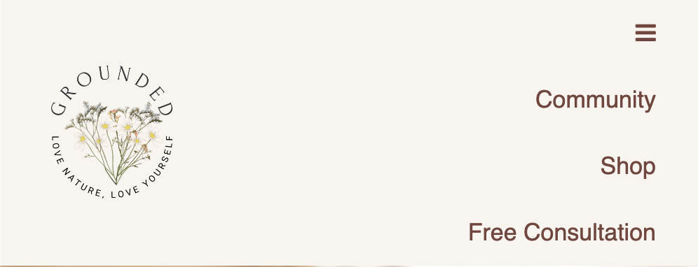
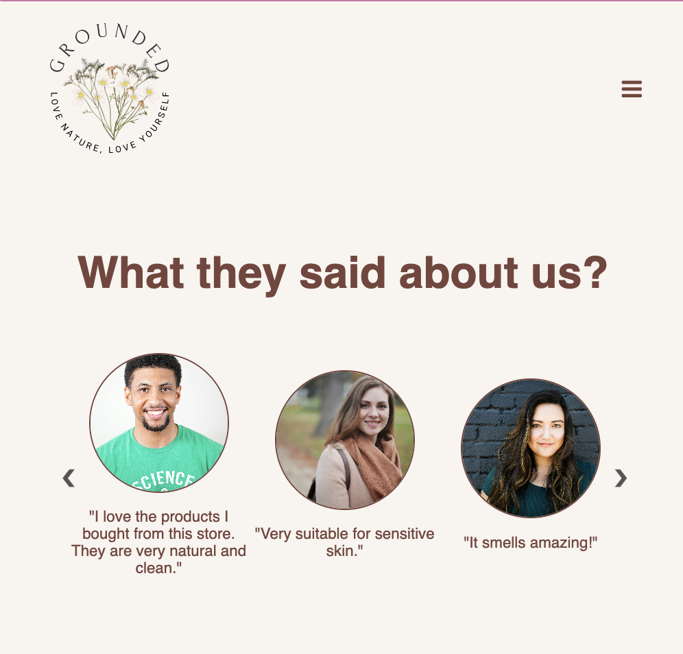

# Grounded Project

## About me
Hi, I'm Evania. 
I made this project as a final checkpoint for my software engineer program. 
It's not perfect because I was in hurry while doing this. I trapped in another city while I was planing to go back my home at East Nusa tengara, due to volcanic erupsion my plane can't reach my hometown! I tried my best to finish this project. 

## The Project
So, I made a website for grounded, an online marketplace to buy organic body products. 
I used pure html, css and JS. 
You can visit the web [here]().

1. Navigation
- The Navigation is sticky (or maybe fixed). The navbar will stay at the top when you try to scroll down.

2. Main
- I centered this using flex. Lil bit amazed with myself. 

- I used grid to display the product. Pssst, you will see a fade in animated when scroll down through the product!

- I also made a carrousel, it took a long time for me to figure this out, pheww finally can made it. 

3. Responsive 
- I made the navbar responsive too, you can toggle the hamburger button, and it will shows you the full option

- The products will be single displayed

- and the review will be more smaller *it's not perfect :(

Note: I didn't make the registration pop up form because I didn't have enough time, I will definitely make it maybe in 2 days later. 

Hope you enjoy!